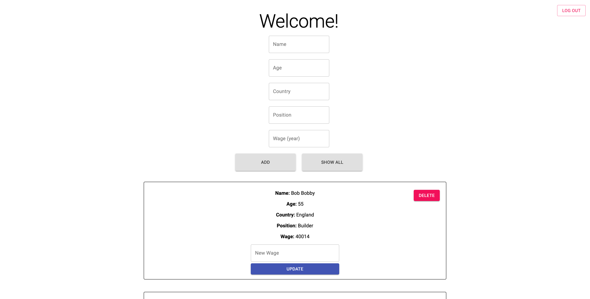

<h1 align="center">Employee-System</h1>
<a href="https://dazzling-keller-4102cc.netlify.app" target="_blank">Site Link</a>
 
<a href="https://github.com/joshtn/Employee-System-backend" target="_blank">Link to github repo with backend code</a>

Fullstack Crud application. You have a login system, a place where you can add new employees and delete old ones. Using a SQL database to store information. Give the site a few seconds to load up. (due to hosting)

## Technologies

Project is created with:

- React
- SQL
- Express
- Material-UI

## Contributing

Contributions are welcome!
